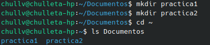
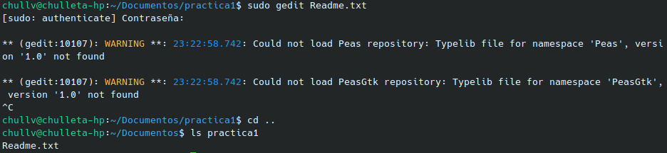
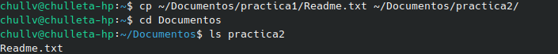
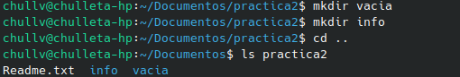
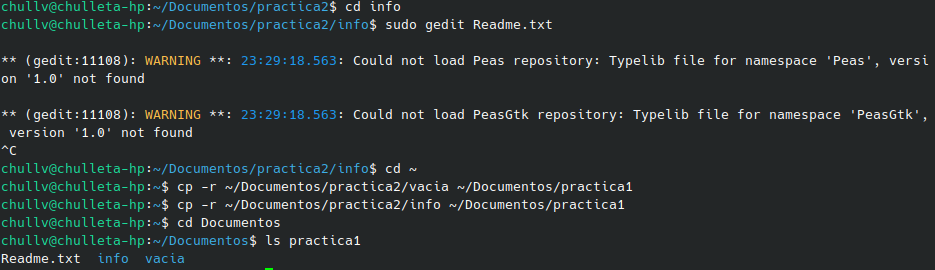
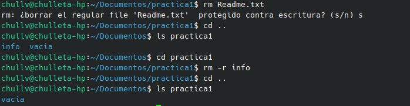

# Práctica de Sistemas Operativos: Manejo de Directorios y Archivos en Ubuntu

## Introducción

El presente repositorio contiene el desarrollo de una práctica correspondiente a la materia **Sistemas Operativos**, enfocada en el manejo básico de directorios y archivos desde la terminal de Ubuntu. Se trabajó con comandos fundamentales como `mkdir`, `gedit`, `ls -l`, `cp` y `rm`, con el fin de comprender cómo el sistema operativo gestiona la creación, copia y eliminación de archivos y carpetas.

## Objetivos

### Objetivo general

Comprender el manejo del sistema de archivos en Ubuntu a través de la terminal, mediante la creación, copia y eliminación de directorios y archivos, relacionando los resultados obtenidos con el funcionamiento interno del sistema operativo.

### Objetivos específicos

* Crear directorios utilizando el comando `mkdir` desde la terminal.
* Crear y editar archivos de texto utilizando el editor `gedit`.
* Listar el contenido de directorios utilizando `ls -l` y analizar la información mostrada.
* Copiar archivos y carpetas entre directorios utilizando el comando `cp` y sus distintas opciones.
* Eliminar archivos y carpetas utilizando el comando `rm`, comprendiendo los riesgos asociados a su uso.

## Estructura del proyecto

```text
Practica/
│
├── Codigo/
│   ├── script1.sh
│   ├── script2.sh
│   └── ...
│
├── Terminal/
│   ├── captura1.png
│   ├── captura2.png
│   └── ...
│
├── Reporte/
│   └── Reporte.pdf
│
├── Video/
│   └── video_practica.mp4
│
└── README.md
```

| Carpeta | Contenido |
|---|---|
| `Codigo/` | Scripts en Bash desarrollados para la práctica. |
| `Terminal/` | Capturas de pantalla que evidencian la ejecución de los comandos. |
| `Reporte/` | Documento PDF con el análisis reflexivo y la justificación teórica. |
| `Video/` | Video demostrativo de 2 a 3 minutos con el funcionamiento en vivo de la práctica. |

## Comandos utilizados

| Comando | Sintaxis | Descripción | Uso en la práctica | Comportamiento del SO observado |
|---|---|---|---|---|
| `mkdir` | `mkdir [nombre_carpeta]` | Crea un nuevo directorio en la ubicación indicada. | Se utilizó para crear las carpetas `practica1` y `practica2` dentro de `Documentos`, así como las subcarpetas `vacia` e `info` dentro de `practica2`. | Permite observar cómo el sistema operativo reserva espacio en el sistema de archivos para un nuevo directorio y lo registra dentro de la jerarquía de carpetas. |
| `gedit` | `sudo gedit [archivo]` | Abre el editor de texto gráfico `gedit`; si el archivo no existe, lo crea al guardarlo. | Se utilizó para crear y escribir el archivo `Readme.txt` dentro de `practica1`, y un archivo de texto dentro de la carpeta `info`. | Muestra la creación de un nuevo inodo en el sistema de archivos al momento de guardar el archivo por primera vez. |
| `ls -l` | `ls -l [ruta]` | Lista el contenido de un directorio en formato largo, mostrando permisos, propietario, grupo, tamaño y fecha de modificación. | Se ejecutó dentro de `practica1` para verificar la creación del archivo `Readme.txt`. | Permite observar los metadatos que el sistema operativo asocia a cada archivo (permisos, propietario y tiempos de modificación). |
| `cp` | `cp [origen] [destino]` | Copia archivos o carpetas de una ubicación a otra. | Se utilizó para copiar el archivo `Readme.txt` de `practica1` a `practica2`. | Evidencia cómo el sistema operativo duplica el contenido de un archivo, generando una nueva entrada independiente en el sistema de archivos. |
| `cp -v` | `cp -v archivo destino/` | Copia en modo *verbose*, mostrando en pantalla qué se copió. | Disponible como opción para visualizar el detalle de la copia realizada. | Permite verificar en tiempo real la operación de copiado ejecutada por el sistema. |
| `cp -i` | `cp -i archivo destino/` | Copia en modo interactivo, preguntando antes de sobrescribir un archivo existente con el mismo nombre. | Disponible como opción de seguridad al copiar archivos que pudieran ya existir en el destino. | Muestra el mecanismo de protección del sistema ante la posible pérdida de datos por sobrescritura. |
| `cp -r` | `cp -r carpeta_origen/ carpeta_destino/` | Copia carpetas completas de manera recursiva, incluyendo su contenido. | Se utilizó para copiar las carpetas `vacia` e `info` desde `practica2` hacia `practica1`. | Permite observar cómo el sistema operativo recorre y replica una estructura completa de directorios y archivos. |
| `rm` | `rm archivo.txt` | Elimina un archivo del sistema de forma permanente. | Se utilizó para eliminar el archivo `Readme.txt` dentro de `practica1`. | Evidencia que el sistema operativo libera el espacio ocupado por el archivo sin enviarlo a una papelera de reciclaje. |
| `rm -r` | `rm -r carpeta/` | Elimina una carpeta y todo su contenido de forma recursiva y permanente. | Se utilizó para eliminar la carpeta `info` dentro de `practica1`. | Muestra el riesgo del uso de este comando, ya que la eliminación es irreversible desde la terminal. |

## Desarrollo de la práctica

1. **Apertura de la terminal:** En el modo visual de Ubuntu, se abrió la carpeta `Documentos` y, dando clic derecho sobre un espacio en blanco, se seleccionó la opción **Abrir en terminal**.

2. **Creación de directorios:** Desde la terminal, dentro de `Documentos`, se crearon dos carpetas utilizando `mkdir`:

   ```bash
   mkdir practica1
   mkdir practica2
   ```

3. **Creación y edición de un archivo de texto:** Se ingresó a la carpeta `practica1` y se ejecutó el siguiente comando para crear y abrir un archivo de texto con `gedit`:

   ```bash
   sudo gedit Readme.txt
   ```

   Se escribió contenido dentro del archivo y se guardó mediante el botón **Save**.

4. **Verificación del contenido del directorio:** Dentro de la misma terminal, en `practica1`, se listó el contenido del directorio para confirmar la creación del archivo:

   ```bash
   ls -l
   ```

5. **Copia de archivos entre carpetas:** Utilizando `cp`, se copió el archivo `Readme.txt` de `practica1` a `practica2`:

   ```bash
   cp ~/Documentos/practica1/Readme.txt ~/Documentos/practica2/
   ```

6. **Creación de subcarpetas y archivo dentro de `practica2`:** Desde la terminal, ubicados en `practica2`, se crearon dos carpetas:

   * `vacia` — sin ningún archivo en su interior.
   * `info` — dentro de la cual se creó un archivo de texto, siguiendo el mismo procedimiento del paso 3.

7. **Copia de carpetas de forma recursiva:** Se copiaron las carpetas `vacia` e `info` desde `practica2` hacia `practica1`, utilizando la opción `-r` de `cp`:

   ```bash
   cp -r ~/Documentos/practica2/vacia ~/Documentos/practica1
   cp -r ~/Documentos/practica2/info ~/Documentos/practica1
   ```

8. **Eliminación de archivos y carpetas:** Dentro de `practica1`, se eliminó el archivo `Readme.txt` y posteriormente se eliminó la carpeta `info` junto con su contenido:

   ```bash
   rm Readme.txt
   rm -r info
   ```

Referencias a la evidencia generada:

* Código: [Ver carpeta `Codigo/`](Codigo/)
* Capturas de terminal: [Ver carpeta `Terminal/`](Terminal/)
* Reporte técnico: [Ver carpeta `Reporte/`](Reporte/)
* Video demostrativo: [Ver carpeta `Video/`](Video/)

## Evidencias

### Captura 1 — Creación de carpetas con `mkdir`



### Captura 2 — Verificación con `ls -l`



### Captura 3 — Copia de archivos con `cp`



### Captura 4 — Creación de directorios con mkdir



### Captura 5 — Copia de directorios con cp -r



### Captura 5 — Eliminación con `rm` y `rm -r`



## Código / Scripts

El script en Bash que automatiza los pasos de esta práctica se encuentra en la carpeta [`Codigo/`](Codigo/).

* `script1.sh`: crea las carpetas `practica1` y `practica2`, genera el archivo `Readme.txt`, lista el contenido con `ls -l`, copia el archivo y las carpetas `vacia` e `info` entre directorios, y finalmente elimina `Readme.txt` y la carpeta `info`.

## Reporte

El documento con el análisis reflexivo y la justificación teórica de las observaciones realizadas durante la práctica se encuentra disponible en la carpeta [`Reporte/`](Reporte/), en formato PDF.

## Video demostrativo

El video que demuestra en vivo el funcionamiento de la práctica (duración aproximada de 2 a 3 minutos) se encuentra disponible en la carpeta [`Video/`](Video/).

## Análisis técnico

A partir de los comandos ejecutados, se puede analizar el comportamiento del sistema operativo en aspectos como:

* La gestión del sistema de archivos jerárquico al crear directorios con `mkdir`.
* Los metadatos asociados a cada archivo (permisos, propietario, tamaño y fecha), visibles mediante `ls -l`.
* El proceso de duplicación de datos al copiar archivos y carpetas con `cp`, incluyendo su variante recursiva `cp -r`.
* La liberación de espacio en el sistema de archivos al eliminar archivos y carpetas con `rm` y `rm -r`, así como la ausencia de una papelera de reciclaje desde la terminal.

## Conclusiones

La práctica permitió comprender de manera directa cómo el sistema operativo Ubuntu gestiona la jerarquía de directorios y archivos a través de la terminal. Se evidenció que comandos como `mkdir` y `cp` construyen y replican estructuras de datos dentro del sistema de archivos, mientras que `rm` y `rm -r` eliminan dicha información de forma permanente, sin un mecanismo de recuperación como una papelera de reciclaje. Esto refuerza la importancia de utilizar comandos destructivos con precaución, así como la utilidad de las opciones interactivas (`-i`) y detalladas (`-v`) para tener mayor control sobre las operaciones realizadas.
