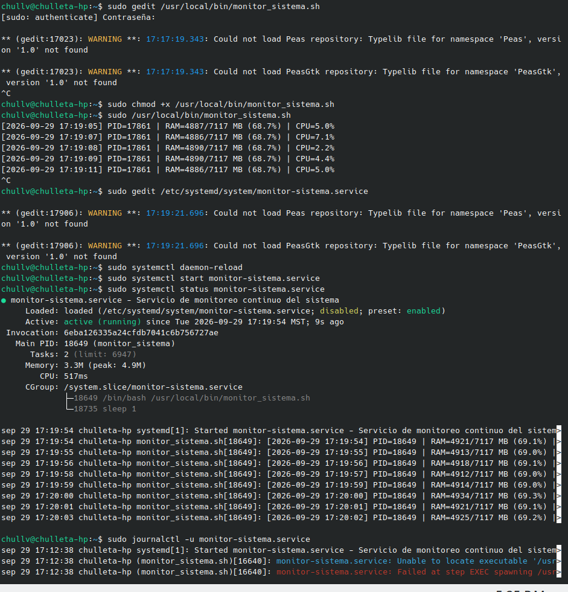
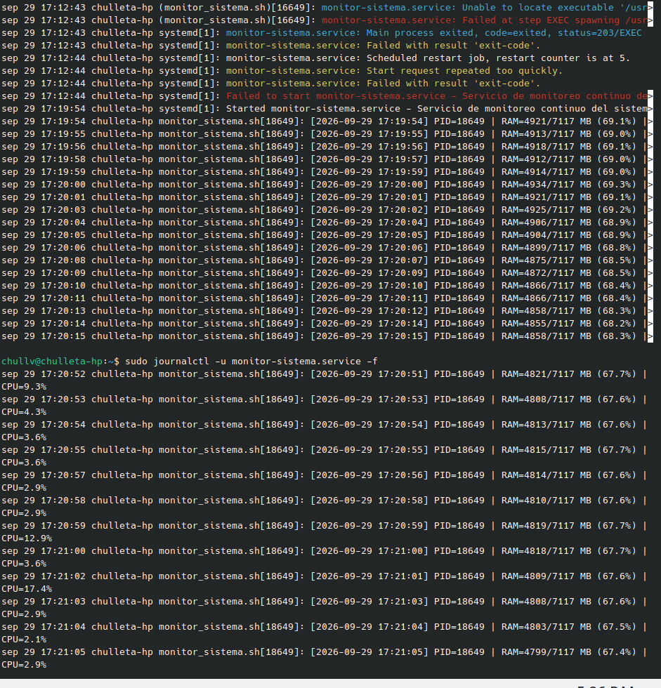
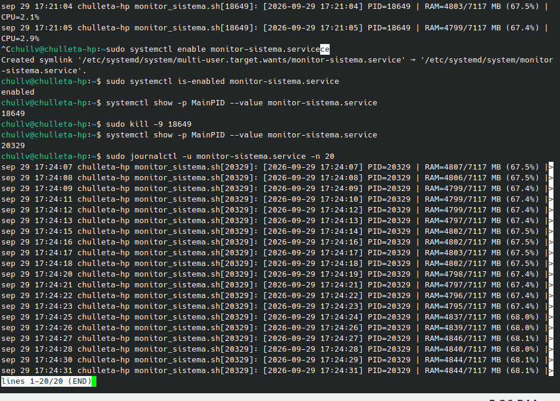

# ⚙️ Servicio de Monitoreo Continuo con systemd


> Práctica de Linux: un script en Bash que se ejecuta **como servicio del sistema** administrado por `systemd`. Registra cada segundo el uso de **RAM y CPU** en el journal, arranca con el sistema y **se reinicia solo** si el proceso muere.

---

## 🧭 Navegación rápida

| Sección | Enlace |
|---|---|
| 📌 Introducción | [Ir](#-introducción) |
| 🎯 Objetivo | [Ir](#-objetivo) |
| 🗂️ Estructura | [Ir](#️-estructura-de-la-carpeta) |
| 🛠️ Desarrollo paso a paso | [Ir](#️-desarrollo-paso-a-paso) |
| 📸 Evidencias | [Ir](#-evidencias) |
| 📊 **Reporte** | [📂 Abrir carpeta de reportes](./Reporte/) |
| ✅ Conclusiones | [Ir](#-conclusiones) |

---

## 📌 Introducción

En la práctica anterior se usó `cron` para ejecutar un script **cada cierto tiempo**. Sin embargo, hay programas que deben estar **siempre en ejecución** (servidores web, bases de datos, agentes de monitoreo). Para eso Linux usa **`systemd`**, el gestor de servicios que arranca el sistema y vigila los procesos: si uno falla, puede volver a iniciarlo automáticamente.

| | `cron` | `systemd` (servicio) |
|---|---|---|
| Tipo de ejecución | Periódica (inicia, termina, espera) | Continua (proceso siempre vivo) |
| Si el proceso muere | Espera a la siguiente ejecución | Lo reinicia (`Restart=always`) |
| Registro | Archivo `.log` manual | `journalctl` (journal del sistema) |
| Arranque con el sistema | Implícito | `systemctl enable` |

## 🎯 Objetivo

Crear un **servicio de systemd** que ejecute un script de monitoreo de forma continua, que se inicie automáticamente con el sistema y que se **recupere solo** cuando su proceso es terminado a la fuerza.

---

## 🗂️ Estructura de la carpeta

```text
Servicio Systemd/
├── Codigo/
│   ├── monitor_sistema.sh          # Script de monitoreo
│   └── monitor-sistema.service     # Unidad de systemd
├── Terminal/
│   ├── paso1.png                   # Script, servicio y arranque
│   ├── paso2.png                   # Journal y seguimiento en vivo
│   └── paso3.png                   # enable, kill -9 y reinicio
├── Reporte/
│   └── Reporte_Servicio_Systemd.pdf
├── Video/
└── readme.md
```

---

## 🛠️ Desarrollo paso a paso

### 1️⃣ Crear el script `monitor_sistema.sh`

Se creó en `/usr/local/bin/`, la ruta estándar para scripts locales del administrador:

```bash
sudo gedit /usr/local/bin/monitor_sistema.sh
```

<details>
<summary><b>👉 Haz clic para ver el contenido del script</b></summary>

```bash
#!/bin/bash

while true
do
    FECHA=$(date "+%Y-%m-%d %H:%M:%S")

    RAM=$(free -m | awk '/Mem:/ {
        printf "%d/%d MB (%.1f%%)", $3, $2, ($3/$2)*100
    }')

    CPU=$(LC_ALL=C top -bn1 | awk -F',' '/Cpu\(s\)/ {
        for(i=1;i<=NF;i++)
            if($i ~ / id/) {
                gsub(/[^0-9.]/,"",$i)
                printf "%.1f%%", 100-$i
                exit
            }
    }')

    echo "[$FECHA] PID=$$ | RAM=$RAM | CPU=$CPU"

    sleep 1
done
```

| Parte | Qué hace |
|---|---|
| `while true ... done` | Ciclo infinito: el script nunca termina por sí solo |
| `date "+%Y-%m-%d %H:%M:%S"` | Fecha y hora de la medición |
| `free -m` + `awk` | Toma la fila `Mem:` y calcula RAM usada / total en MB y su porcentaje |
| `LC_ALL=C top -bn1` | Una sola muestra de `top` en modo batch, forzando formato en inglés (punto decimal y la etiqueta `id`) |
| `awk -F','` + `100 - id` | Busca el % de CPU inactivo (`id`) y lo resta de 100 para obtener el % de uso |
| `$$` | PID del propio script; permite comprobar el PID que reporta systemd |
| `echo` | Imprime a la salida estándar, que systemd envía al **journal** |
| `sleep 1` | Pausa de 1 segundo entre mediciones |

</details>

### 2️⃣ Dar permisos de ejecución y probarlo manualmente

```bash
sudo chmod +x /usr/local/bin/monitor_sistema.sh
sudo /usr/local/bin/monitor_sistema.sh      # Ctrl+C para detenerlo
```

```text
[2026-09-29 17:19:05] PID=17861 | RAM=4887/7117 MB (68.7%) | CPU=5.0%
[2026-09-29 17:19:07] PID=17861 | RAM=4886/7117 MB (68.7%) | CPU=7.1%
```

### 3️⃣ Crear la unidad `monitor-sistema.service`

```bash
sudo gedit /etc/systemd/system/monitor-sistema.service
```

```ini
[Unit]
Description=Servicio de monitoreo continuo del sistema
After=multi-user.target

[Service]
Type=simple
ExecStart=/usr/local/bin/monitor_sistema.sh
Restart=always
RestartSec=1

[Install]
WantedBy=multi-user.target
```

<details>
<summary><b>👉 Haz clic para entender cada directiva</b></summary>

| Sección | Directiva | Significado |
|---|---|---|
| `[Unit]` | `Description` | Nombre descriptivo que aparece en `systemctl status` y en el journal |
| `[Unit]` | `After=multi-user.target` | Orden de arranque respecto al modo multiusuario |
| `[Service]` | `Type=simple` | El proceso de `ExecStart` **es** el servicio (no se va a segundo plano) |
| `[Service]` | `ExecStart` | Ruta absoluta del programa a ejecutar |
| `[Service]` | `Restart=always` | Reinicia el servicio **siempre** que termine, sin importar la causa |
| `[Service]` | `RestartSec=1` | Espera 1 segundo antes de reiniciarlo |
| `[Install]` | `WantedBy=multi-user.target` | Al hacer `enable`, el servicio arranca con el sistema |

</details>

### 4️⃣ Recargar systemd, iniciar y verificar

```bash
sudo systemctl daemon-reload                  # Leer la unidad nueva
sudo systemctl start monitor-sistema.service  # Iniciar el servicio
sudo systemctl status monitor-sistema.service # Ver su estado
```

Resultado: `Active: active (running)` con **Main PID 18649**.

### 5️⃣ Consultar los registros

```bash
sudo journalctl -u monitor-sistema.service        # Historial completo
sudo journalctl -u monitor-sistema.service -f     # En vivo (como tail -f)
sudo journalctl -u monitor-sistema.service -n 20  # Últimas 20 líneas
```

### 6️⃣ Habilitar el arranque automático

```bash
sudo systemctl enable monitor-sistema.service
sudo systemctl is-enabled monitor-sistema.service   # → enabled
```

`enable` crea un enlace simbólico en `multi-user.target.wants/`, por eso el servicio se iniciará en cada arranque.

### 7️⃣ Prueba de recuperación: matar el proceso

```bash
systemctl show -p MainPID --value monitor-sistema.service   # → 18649
sudo kill -9 18649                                          # SIGKILL
systemctl show -p MainPID --value monitor-sistema.service   # → 20329
```

El proceso fue eliminado con `SIGKILL` y **systemd lo levantó de nuevo en ~1 segundo** con un PID distinto, gracias a `Restart=always` y `RestartSec=1`.

---

## 📸 Evidencias

> 🔍 **Haz clic en cualquier imagen para verla en tamaño completo.**

### Paso 1 — Script, unidad del servicio y arranque

[](Terminal/paso1.png)

Se edita el script, se le da permiso de ejecución y se prueba a mano (PID 17861). Después se crea la unidad, se ejecuta `daemon-reload` y `start`. El `status` muestra el servicio **active (running)** con PID 18649, y en el `CGroup` aparecen el script y su `sleep 1`. Al final del journal se ve un **primer intento fallido** a las 17:12:38.

### Paso 2 — Journal: del error a la ejecución continua

[](Terminal/paso2.png)

El journal documenta el error inicial: `Unable to locate executable` y `status=203/EXEC` (el script aún no existía o no era ejecutable en esa ruta). Como `Restart=always` lo reintentaba cada segundo, systemd llegó al **contador de reinicios 5** y lo bloqueó con `Start request repeated too quickly`. Tras corregir el script, a las **17:19:54** inicia correctamente y `journalctl -f` muestra las mediciones en vivo.

### Paso 3 — Habilitar el servicio y prueba con `kill -9`

[](Terminal/paso3.png)

Se habilita el servicio (`enabled`), se consulta el PID (**18649**), se mata con `kill -9` y systemd lo relanza con el nuevo PID **20329**. Las últimas 20 líneas del journal confirman que el nuevo proceso sigue registrando desde las **17:24:07**.

---

## 📊 Resultados

| Recurso | Enlace |
|---|---|
| 📂 Reporte | [**`/Reporte`**](./Reporte/) |

### 🔎 Interpretación de las mediciones

| Métrica | Valor observado | Estado |
|---|---|---|
| 🧠 RAM | ≈ 4 795 – 4 934 MB de 7 117 MB (67.4 % – 69.3 %) | 🟡 Uso moderado-alto, estable |
| ⚙️ CPU | 2.1 % – 17.4 % (picos breves) | 🟢 Baja |
| 🪶 Consumo del servicio | 3.3 MB de memoria (pico 4.9 MB) | 🟢 Muy ligero |
| 🔁 Recuperación tras `kill -9` | Nuevo PID en ≈ 1 s | 🟢 Correcta |

> 💡 **Observación:** aunque el script duerme 1 segundo, en el journal a veces se salta un segundo (p. ej. 17:24:18 → 17:24:20). Es porque `top -bn1` tarda unas décimas en tomar la muestra, así que cada ciclo dura algo más de 1 s.

---

## 🧰 Comandos útiles de gestión

```bash
systemctl status monitor-sistema.service     # Estado del servicio
sudo systemctl stop monitor-sistema.service  # Detenerlo
sudo systemctl restart monitor-sistema.service
sudo systemctl disable monitor-sistema.service  # Quitar arranque automático
sudo systemctl reset-failed monitor-sistema.service  # Limpiar el bloqueo "repeated too quickly"
journalctl -u monitor-sistema.service --since "10 min ago"
```

<details>
<summary><b>🧹 Desinstalar el servicio por completo</b></summary>

```bash
sudo systemctl disable --now monitor-sistema.service
sudo rm /etc/systemd/system/monitor-sistema.service
sudo rm /usr/local/bin/monitor_sistema.sh
sudo systemctl daemon-reload
```

</details>

---

## ✅ Conclusiones

- `systemd` permite mantener un programa **en ejecución permanente** y bajo supervisión, algo que `cron` no ofrece.
- `Restart=always` + `RestartSec=1` hacen que el servicio se **recupere solo** incluso ante un `kill -9`.
- `systemctl enable` garantiza que el monitoreo arranque con el sistema, sin intervención del usuario.
- `journalctl` centraliza los registros: no hace falta redirigir la salida a un archivo, y queda también el historial de errores.
- El error `203/EXEC` enseñó a revisar que el `ExecStart` apunte a un archivo **existente y ejecutable**, y el límite de reinicios mostró que systemd protege al sistema de servicios que fallan en bucle.

---

## 🎥 Video de la práctica

| Recurso | Enlace |
|---|---|
| 📂 Carpeta del video | [**`/Video`**](./Video/) |
